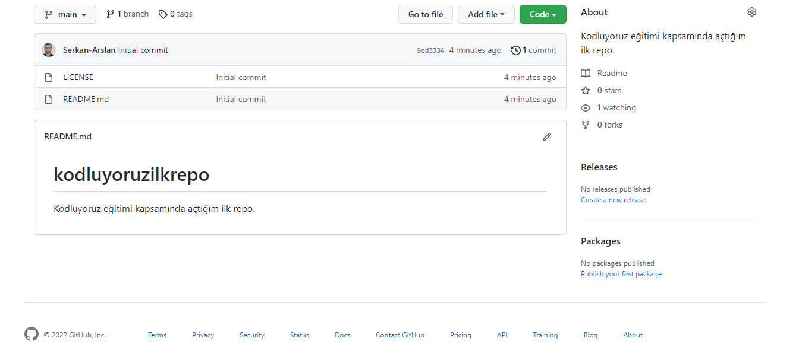

# kodluyoruzilkrepo
Kodluyoruz eğitimi kapsamında açtığım ilk repo.

## Installation

Öncelikle projeyi klonlayın

```
git clone https://github.com/Serkan-Arslan/kodluyoruzilkrepo.git
```

## Usage

Projeyi cloneladıktan sonra Visual Studio Code programında açınız.

Linux için:
```linux
cd kodluyoruzilkrepo
code .
```

## Contributing
Pull requestler kabul edilir. Büyük değişiklikler için, lütfen önce neyi değiştirmek istediğinizi tartışmak için bir konu açınız.


## License
[MIT](https://choosealicense.com/licenses/mit/)